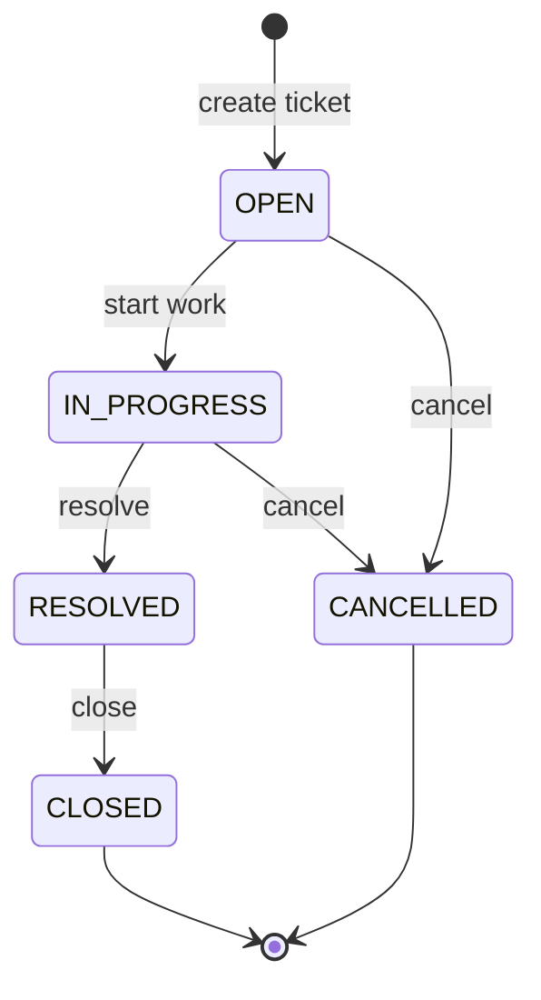

# Ticket Status State Machine — TicketMgmtSystem

**Status:** Approved  
**Last updated:** 2026-09-25  
**Applies to:** `PATCH /api/v1/tickets/{ticketId}/status` (see `spec/api-contract.md`)

This is a **backend business rule**. The service layer must validate every status change. The frontend may guide users, but **must not be the only enforcement**.

---

## 1. Status values

| Code | Label | Terminal? |
|------|-------|-------------|
| `OPEN` | Open | No |
| `IN_PROGRESS` | In Progress | No |
| `RESOLVED` | Resolved | No |
| `CLOSED` | Closed | **Yes** |
| `CANCELLED` | Cancelled | **Yes** |

Terminal statuses (`CLOSED`, `CANCELLED`) allow **no further transitions**.

---

## 2. Allowed transitions

Exactly **five** transitions are permitted:

| # | From | To | Typical meaning |
|---|------|-----|-----------------|
| 1 | `OPEN` | `IN_PROGRESS` | Agent starts work |
| 2 | `IN_PROGRESS` | `RESOLVED` | Issue fixed, awaiting confirmation |
| 3 | `RESOLVED` | `CLOSED` | Ticket completed |
| 4 | `OPEN` | `CANCELLED` | Ticket withdrawn before work started |
| 5 | `IN_PROGRESS` | `CANCELLED` | Ticket withdrawn while in progress |

**Any other from → to pair is invalid** and must be rejected by the backend.

---

## 3. State diagram



ASCII equivalent:

```
                    ┌─────────────┐
                    │    OPEN     │
                    └──────┬──────┘
           cancel          │ start work
              ┌────────────┼────────────┐
              ▼            ▼            │
       ┌────────────┐  ┌────────────┐   │
       │ CANCELLED  │  │IN_PROGRESS │   │
       └────────────┘  └─────┬──────┘   │
              ▲              │ resolve    │ cancel
              │              ▼            │
              │         ┌─────────┐      │
              └─────────┤RESOLVED │      │
                        └────┬────┘      │
                             │ close     │
                             ▼           │
                        ┌─────────┐      │
                        │ CLOSED  │      │
                        └─────────┘      │
```

---

## 4. Invalid transitions (examples)

All of the following must return **409 Conflict** from the API. Grouped by reason.

### 4.1 Terminal state — no exit allowed

| From | To | Why invalid |
|------|-----|-------------|
| `CLOSED` | `OPEN` | Terminal state |
| `CLOSED` | `IN_PROGRESS` | Terminal state |
| `CLOSED` | `RESOLVED` | Terminal state |
| `CLOSED` | `CANCELLED` | Terminal state |
| `CANCELLED` | `OPEN` | Terminal state |
| `CANCELLED` | `IN_PROGRESS` | Terminal state |
| `CANCELLED` | `RESOLVED` | Terminal state |
| `CANCELLED` | `CLOSED` | Terminal state |

### 4.2 Skips a required step

| From | To | Why invalid |
|------|-----|-------------|
| `OPEN` | `RESOLVED` | Must go through `IN_PROGRESS` |
| `OPEN` | `CLOSED` | Must go through `IN_PROGRESS` → `RESOLVED` |
| `IN_PROGRESS` | `CLOSED` | Must go through `RESOLVED` |
| `IN_PROGRESS` | `OPEN` | Cannot revert to open |

### 4.3 Wrong path or backwards move

| From | To | Why invalid |
|------|-----|-------------|
| `RESOLVED` | `OPEN` | Cannot reopen |
| `RESOLVED` | `IN_PROGRESS` | Cannot revert to in progress |
| `RESOLVED` | `CANCELLED` | Cancel only from `OPEN` or `IN_PROGRESS` |

### 4.4 No-op (same status)

| From | To | Why invalid |
|------|-----|-------------|
| `OPEN` | `OPEN` | Already in target status |
| `IN_PROGRESS` | `IN_PROGRESS` | Already in target status |
| `RESOLVED` | `RESOLVED` | Already in target status |

> Treat same-status requests as **409**, not 200. Message: `Ticket is already in status {status}`.

---

## 5. API error response

Invalid transitions use **`PATCH /api/v1/tickets/{ticketId}/status`** and return:

| HTTP status | When |
|-------------|------|
| **409 Conflict** | Any disallowed transition (§4) |
| **400 Bad Request** | Missing/unknown `status` value in request body |
| **404 Not Found** | Ticket ID does not exist |

### 409 response body

```json
{
  "status": 409,
  "error": "Conflict",
  "message": "Cannot transition ticket from OPEN to RESOLVED",
  "timestamp": "2026-09-25T10:00:00Z"
}
```

**Message format:** `Cannot transition ticket from {currentStatus} to {requestedStatus}`

### 400 response body (unknown status code)

```json
{
  "status": 400,
  "error": "Bad Request",
  "message": "Validation failed",
  "timestamp": "2026-09-25T10:00:00Z",
  "errors": [
    { "field": "status", "message": "must be a valid status code" }
  ]
}
```

---

## 6. Backend enforcement

| Layer | Responsibility |
|-------|----------------|
| **Controller** | Accept `ChangeTicketStatusRequest`, delegate to service |
| **Service** | Load ticket, validate transition against this document, persist or throw |
| **Repository** | Persist new status only after service approval |
| **Database** | **No** CHECK constraints or triggers for transitions — logic stays in Java |

### Implementation pattern

1. Load ticket by ID → **404** if missing.
2. Read current status and requested status from request.
3. If requested status is not a valid enum/code → **400**.
4. If `current == requested` → **409** (no-op).
5. If transition is not in the allowed table (§2) → **409**.
6. Otherwise update status and return **200** with `TicketResponse`.

### Domain exception

```text
InvalidTicketStatusTransitionException(currentStatus, requestedStatus)
  → mapped to 409 by GlobalExceptionHandler
```

---

## 7. What must not change status

These endpoints **must not** accept a `status` field (status changes only via `/status`):

- `POST /api/v1/tickets` — server sets `OPEN` on create
- `PATCH /api/v1/tickets/{ticketId}` — title, description, priority, assignee only

Reject `status` in create/update body with **400** if sent.

---

## 8. Testing requirements

Every row in §2 (valid) and a representative sample from §4 (invalid) must have tests. Minimum:

**Service unit tests (`*ServiceTest`):**

- Each of the 5 allowed transitions succeeds
- At least one invalid case per group in §4.1–§4.4
- Parameterized test recommended for full invalid matrix

**API tests (`*ControllerTest`):**

- Allowed transition → **200** + correct `status` in body
- Invalid transition → **409** + message matches format in §5
- Unknown status value → **400**

See `rules/testing.mdc` for naming and tooling conventions.

---

## 9. References

- `spec/api-contract.md` — §4 Status changes
- `spec/data-model.md` — `ticket_status` seed data
- `rules/api-standards.mdc` — 409 for conflicts
- `rules/testing.mdc` — transition test expectations
